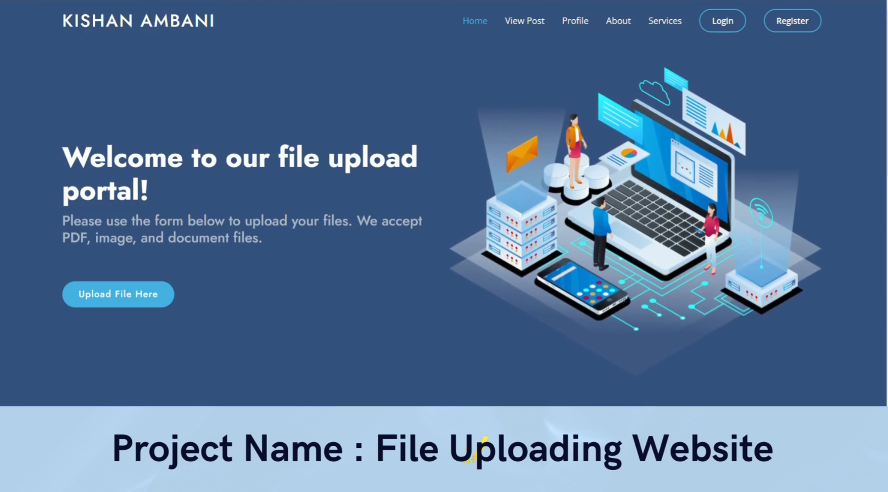

# File_Uploading_Web_Using_Service_Repository_Pattern_in_Laravel

## 
Laravel Project

# Description : 
This Laravel project demonstrates a file uploading system using the Service Repository Pattern. The application allows users to upload images, PDFs, DOCs, and text files, with certain features only accessible to authenticated users. The project showcases a robust and scalable way to handle file uploads and manage user authentication using Laravel's built-in tools.

# Features
## 1. File Uploads:
• Supports uploading images, PDFs, DOCs, and text files.

• Authenticated users can upload files.

## 2. Authentication:
• Uses Laravel's authentication to manage user logins.

• Only logged-in users can upload files.

• All users, whether logged in or not, can view uploaded files.

## 3. File Management:
• Only the user who uploaded a file can delete it.

• Profile section for users to manage their uploads.

## 4. Service Repository Pattern:
• Implements the Service Repository Pattern for better code organization and maintainability.

• Separates business logic from controllers, making the codebase cleaner and easier to manage.

# Installation

1. git clone
2. composer install or update
3. Copy .env.example to .env.
4. Update the database configuration in the .env file.
5. php artisan key:generate
6. php artisan migrate
7. php artisan serve

------------------------------------------------------------------------------------------------------------------------

